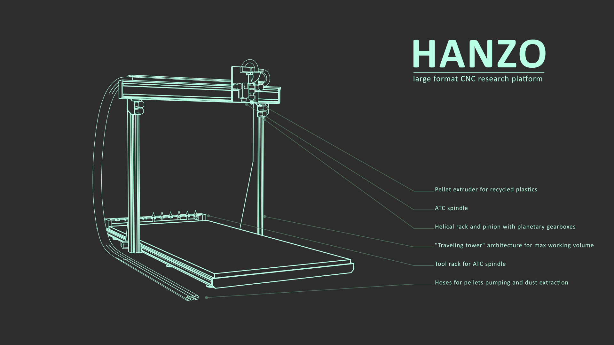
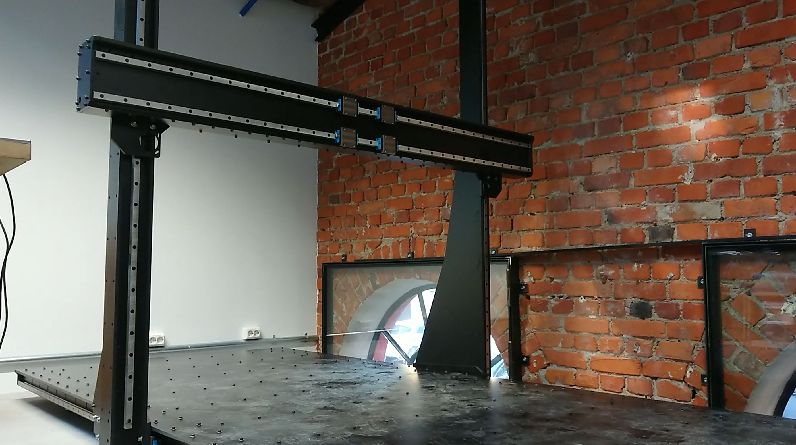
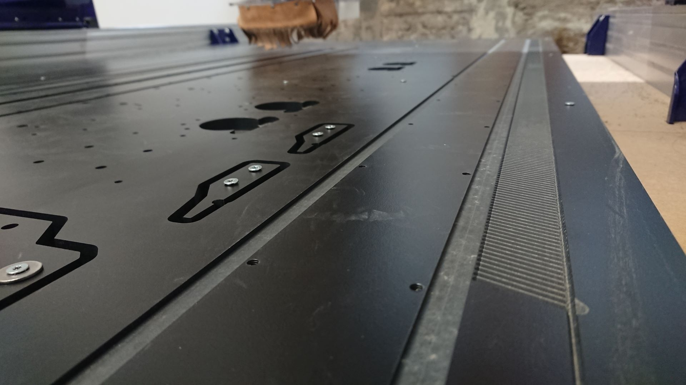
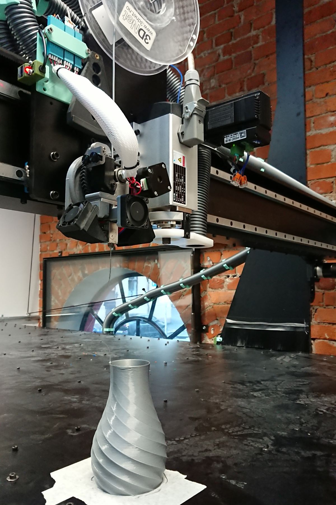

# Hanzo - large format 3D printer and machining center

*by Jens Dyvik, August 2021 - ongoing*

### Project status

 - Currently under development. **Warning:** This experimental project is not reccomended to reproduce, but the files can be used as a design reference.

### What

 - A cartesian machine with a 3m x 1,4m x 1,5m work area
 - Able to print rough and fast with the [Pellatis - pellet extruder](https://tobben.gitlab.io/pellatis/) that we are developing
 - With a toolchanger system
 - With 3D printed helical pinions and integrated machined helical racks
 - Tailor made to experiment with automation and machine making
 
### Why

 - I need a large machine with a lot of flexibility to do the research that I wont to do the coming years
 - If I have machine with a 3m long work area I can make machines with a 2,44m work area _(standard sheet size)_ for my local community in a single piece
 - I wan to make environmentally friendlier manufacturing methods more available
 - I want to making automation in digital fabrication more accessible

### How

 - I am looking to CNC mill almost all the the parts _(frame, rack, rails)_ from 12mm thick Trespa or other phenolic resin paper composite sheets
 

### Files

 - I am designing Hanzo in [Freecad]() *(free and open CAD software)*
 - I work in the open and publish and update the files in the [project folder](https://github.com/fellesverkstedet/fabricatable-machines/tree/master/hanzo-research-platform) of this repo
 - I also export .step files from freecad to the the [project folder](https://github.com/fellesverkstedet/fabricatable-machines/tree/master/hanzo-research-platform) that you can import into programs like Fusion360, Solidworks, Rhino etc.

### Support

 - If you appreciate this project you can support me on [Patreon](https://www.patreon.com/jensdyvik)
 - If you have design ideas and feedabck, pull requests and git issues are most welcome

### Log:

August 2021

 - The first parts of the machine has been fabricated. Making of video [here](https://youtu.be/XLuoENFNSG0)
 
October 2021

 - Too tight fit at ears on gantry gantry backplate (no tolerence, facepalm). Resorted to sandin. To do: add cleaance in CAD
 - Forgot to mill some pocket slots on gantry backsie (struggeled with freecad step export)
 - Drilling ended up not entirely in center of slots
 - Whashers go over edge. to do check for collsions in CAD!
 - Array of threaded holes are missing in x axis plate.
 - One screw in upper bearing block is maybe too close
 - Hacked pocket and moved slots for gearbox
 - Large M5 whasers protrude over the edge. Uese button heads crews instead?
 - Forgeot to offset motor protrusion slot to fit larger gearbox protrusion (fixe with 12mm offset and remill)
 - Nema23 gear is nema24 width (60mm) Tuning screw holder came too close to motor to allow pinion to completely disengage rack
 - Slot on gearbox does not run deep enough. Pinion protrudes more than planned. Tricky to solve becuse set screws need meat to sit in. Maybe skip using slot and rotate pinion 60 degrees?
 - double nut hack got too wide and the pinion set screws crshes into it. Needs s relief flot the diemter of the pinion set screw stickout +
 
 January-March 2022
 
 - Finished bed
 - Fabbed and assembled gantry and Z towers

### Attributions

 - Duet2 mounting plate by Mjolk https://www.thingiverse.com/thing:3525628/files
